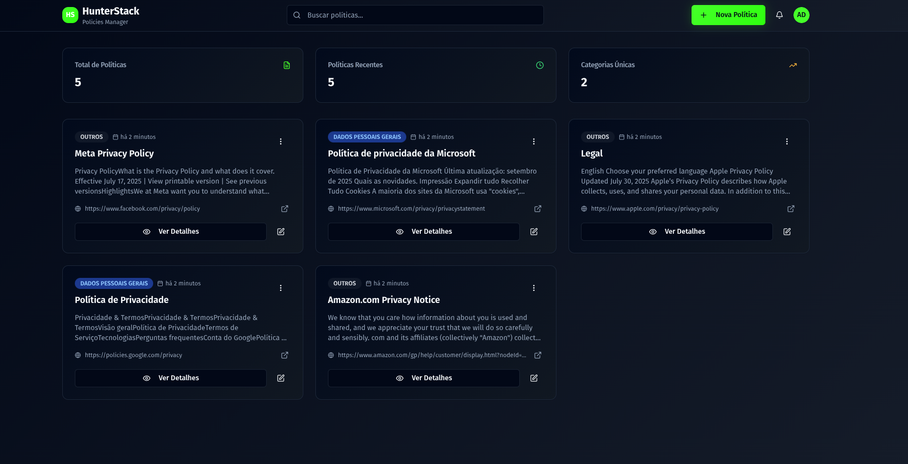

# HunterStack Policies Manager

Sistema completo de gerenciamento inteligente de políticas corporativas desenvolvido com tecnologias modernas. O projeto é composto por uma API REST robusta em Node.js com Fastify e uma interface web moderna em Next.js 15.

## 🚀 Visão Geral

O **HunterStack Policies Manager** é uma solução completa para gerenciamento de políticas empresariais que permite:

- **📝 Gestão Completa de Políticas**: Criar, editar, visualizar e excluir políticas com interface intuitiva
- **🔍 Busca Avançada**: Sistema de pesquisa em tempo real por título, conteúdo e categoria
- **🤖 Ingestion Inteligente**: Sistema automatizado de captura de políticas via URL
- **📊 Categorização**: Organização automática de políticas por categorias
- **📱 Design Responsivo**: Interface adaptável para desktop, tablet e mobile
- **🌓 Modo Escuro/Claro**: Suporte completo a temas com transições suaves
- **💾 Download e Exportação**: Funcionalidades para exportar e compartilhar políticas
- **⚡ Performance Otimizada**: Cache inteligente e carregamento eficiente

## 🏗️ Arquitetura do Projeto

```
hunterstack-teste-tecnico/
├── backend/                 # API REST - Node.js + TypeScript + Fastify
│   ├── src/
│   │   ├── modules/         # Módulos de negócio (policies, ai, ingestion, scraping)
│   │   │   ├── policies/    # CRUD de políticas
│   │   │   ├── ai/          # Serviços de IA para categorização
│   │   │   ├── ingestion/   # Sistema de ingestão de URLs
│   │   │   └── scraping/    # Web scraping e extração de conteúdo
│   │   └── core/            # Configurações e infraestrutura
│   ├── prisma/              # Schema e migrações do banco
│   └── tests/               # Testes de integração
│
├── frontend/                # Interface Web - Next.js 15 + React 19 + TypeScript
│   ├── src/
│   │   ├── app/             # App Router do Next.js 15
│   │   ├── components/      # Componentes React organizados por feature
│   │   │   ├── policies/    # Componentes específicos de políticas
│   │   │   └── ui/          # Design System baseado em shadcn/ui
│   │   ├── hooks/           # Custom hooks para lógica reutilizável
│   │   ├── lib/             # Configurações e utilitários
│   │   └── types/           # Definições de tipos TypeScript
│   └── components.json      # Configuração do shadcn/ui
│
└── docker-compose.yml       # Orquestração de containers
```

## 🛠️ Tecnologias Utilizadas

### Backend
- **Node.js** + **TypeScript** - Ambiente de execução e linguagem
- **Fastify** - Framework web performático e moderno
- **Prisma** - ORM moderno para TypeScript
- **PostgreSQL** - Banco de dados relacional
- **Zod** - Validação de esquemas
- **Vitest** - Framework de testes

### Frontend
- **Next.js 15** - Framework React com App Router e Turbopack
- **React 19** - Biblioteca de UI com melhorias de performance
- **TypeScript** - Tipagem estática
- **TailwindCSS v4** - Framework CSS utilitário de última geração
- **shadcn/ui** + **Radix UI** - Design System com componentes acessíveis
- **TanStack Query v5** - Gerenciamento de estado servidor
- **React Hook Form** - Gerenciamento de formulários performático
- **Zod** - Validação client-side

### Recursos Avançados
- **AI Integration** - Categorização automática de políticas
- **Web Scraping** - Extração inteligente de conteúdo via Axios e Puppeteer
- **Ingestion System** - Sistema automatizado de captura de políticas

### DevOps
- **Docker** + **Docker Compose** - Containerização
- **ESLint** + **Prettier** - Qualidade e formatação de código

## 🚀 Como Executar o Projeto

### Pré-requisitos

- **Docker** e **Docker Compose**
- **Node.js** v18.17 ou superior (recomendado: v20+)
- **NPM** ou **Yarn** (gerenciador de pacotes)

### Execução Rápida com Docker

1. **Clone o repositório**:

   ```bash
   git clone https://github.com/andreydantasvf/hunterstack-teste-tecnico.git
   cd hunterstack-teste-tecnico
   ```

2. **Inicie todos os serviços**:

   ```bash
   docker-compose up -d
   ```

3. **Execute as migrações do banco de dados**:

   ```bash
   docker exec -it hunterstack_backend npm run prisma:migrate
   ```

4. **Acesse as aplicações**:
   - **Frontend**: <http://localhost:3000>
   - **Backend API**: <http://localhost:3001>
   - **Swagger Docs**: <http://localhost:3001/docs>

### Desenvolvimento Local

Para desenvolvimento, consulte os READMEs específicos:

- **[📚 Backend - API Documentation](./backend/README.md)**
- **[🎨 Frontend - Interface Documentation](./frontend/README.md)**

## 📋 Funcionalidades

### ✅ Implementadas

#### 🏠 Dashboard e Interface
- [x] Interface web responsiva com Next.js 15 e React 19
- [x] Sistema de temas (modo escuro/claro) com next-themes
- [x] Design System baseado em shadcn/ui com componentes acessíveis
- [x] Busca em tempo real com debounce otimizado
- [x] Paginação inteligente para grandes volumes de dados

#### 📝 Gestão de Políticas
- [x] CRUD completo de políticas (Create, Read, Update, Delete)
- [x] Categorização automática e manual de políticas
- [x] Sistema de busca por título, conteúdo e categoria
- [x] Download e exportação de políticas individuais
- [x] Funcionalidade de cópia rápida de conteúdo

#### 🤖 Sistema de Ingestion
- [x] Captura automatizada de políticas via URL
- [x] Web scraping inteligente com Axios e Puppeteer
- [x] Extração automática de conteúdo de páginas web
- [x] Processamento e limpeza de texto extraído

#### ⚙️ Backend e API
- [x] API REST completa com Fastify e TypeScript
- [x] Validação de dados server-side com Zod
- [x] Documentação Swagger automática
- [x] Sistema de cache otimizado com TanStack Query
- [x] Banco de dados PostgreSQL com Prisma ORM

#### 🚀 Performance e DevOps
- [x] Containerização completa com Docker
- [x] Cache inteligente no frontend com React Query
- [x] Otimizações de bundle com Turbopack
- [x] Testes de integração do backend

## 📊 Screenshots



## 🧪 Testando o Sistema

### Testes do Backend

```bash
cd backend
npm run test
```

### Testando a Interface

```bash
cd frontend
npm run dev    # Desenvolvimento local em http://localhost:3000
npm run build  # Build de produção
```

### Ingestion de Políticas

Para testar o sistema de ingestion automática:

```bash
cd backend
npm run ingestion  # Executa script de captura de políticas
```

## 📚 Aplicação em produção

- **[📖 Documentação da API](https://hunterstack-teste-tecnico.onrender.com/docs/)** - Documentação técnica completa da API
- **[🎨 Frontend da aplicação](https://hunterstackpoliciesmanager.vercel.app/)** - Documentação técnica completa da interface

## 📄 Licença

Este projeto foi desenvolvido como parte de um teste técnico para a **HunterStack**.

---

## Desenvolvido com ❤️

Usando as melhores práticas de desenvolvimento moderno com **Next.js 15**, **React 19**, **TypeScript**, **Fastify** e **PostgreSQL**.
