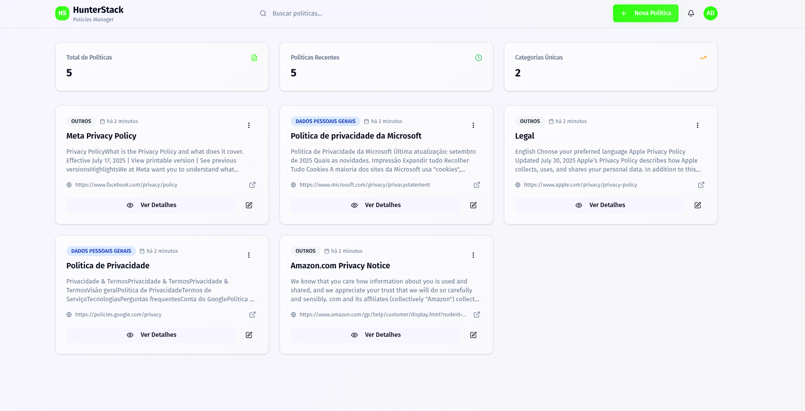

# HunterStack Policies Manager - Frontend

Esta é a aplicação front-end para o **HunterStack Policies Manager**, desenvolvida como parte de um teste técnico. A aplicação é construída com **Next.js 15**, **React 19**, **TypeScript**, **TailwindCSS** e diversas bibliotecas modernas, seguindo as melhores práticas de desenvolvimento front-end para garantir uma experiência de usuário excepcional e código de alta qualidade.

## Tabela de Conteúdos

- [Sobre o Projeto](#sobre-o-projeto)
- [Filosofia e Estrutura do Projeto](#filosofia-e-estrutura-do-projeto)
  - [Arquitetura Component-Based](#arquitetura-component-based)
  - [Estrutura de Pastas](#estrutura-de-pastas)
  - [Design System e Componentes](#design-system-e-componentes)
  - [React Query e Cache](#react-query-e-cache)
  - [Validação e Tipagem](#validação-e-tipagem)
- [Como Iniciar o Projeto](#como-iniciar-o-projeto)
  - [Pré-requisitos](#pré-requisitos)
  - [Passo a Passo](#passo-a-passo)
- [Funcionalidades](#funcionalidades)
- [Padrões de Uso dos Componentes](#padrões-de-uso-dos-componentes)
- [Tecnologias Utilizadas](#tecnologias-utilizadas)
- [Pontos de Melhoria](#pontos-de-melhoria)
- [Screenshots da Aplicação](#screenshots-da-aplicação)
- [Links Relacionados](#links-relacionados)

---

## Sobre o Projeto

O **HunterStack Policies Manager** é uma aplicação web moderna para gerenciamento inteligente de políticas corporativas. A aplicação permite:

- **📝 Gestão Completa de Políticas**: Criar, editar, visualizar e excluir políticas com interface intuitiva
- **🔍 Busca Avançada**: Sistema de pesquisa em tempo real por título, conteúdo e categoria
- **📊 Categorização**: Organização de políticas por categorias para melhor estruturação
- **📱 Design Responsivo**: Interface adaptável para desktop, tablet e mobile
- **🌓 Modo Escuro/Claro**: Suporte completo a temas com transições suaves
- **💾 Download e Cópia**: Funcionalidades para exportar e compartilhar políticas
- **⚡ Performance Otimizada**: Cache inteligente e carregamento eficiente

---

## Filosofia e Estrutura do Projeto

A aplicação front-end foi desenvolvida seguindo uma arquitetura component-based moderna com **Next.js 15**, priorizando a reutilização de código, manutenibilidade e experiência do desenvolvedor. Utiliza **React 19** para componentes mais eficientes e **Server Components** quando apropriado.

### Arquitetura Component-Based

O projeto adota uma estrutura baseada em **Feature-Sliced Design** adaptada para Next.js, onde cada funcionalidade é organizada de forma coesa e autocontida:

- **App Router**: Utiliza o novo sistema de roteamento do Next.js 15 com `app` directory
- **Pages**: Componentes de página que orquestram a interface de cada funcionalidade
- **Services**: Camada de abstração para comunicação com a API
- **Hooks**: Custom hooks para gerenciamento de estado e lógica reutilizável
- **Schemas**: Validação de dados com Zod
- **Types**: Interfaces TypeScript para tipagem estrita
- **Components**: Componentes baseados em shadcn/ui para design system consistente

### Estrutura de Pastas

```text
.
├── public/                  # Arquivos estáticos públicos
│   ├── next.svg
│   ├── vercel.svg
│   └── favicon.ico
├── src/                     # Código-fonte da aplicação
│   ├── app/                 # App Router do Next.js 15
│   │   ├── layout.tsx       # Layout raiz da aplicação
│   │   ├── page.tsx         # Página principal (lista de políticas)
│   │   ├── globals.css      # Estilos globais
│   │   └── favicon.ico      # Ícone da aplicação
│   ├── components/          # Componentes React organizados por categoria
│   │   ├── theme-provider.tsx  # Provider para gerenciamento de tema
│   │   ├── layout/          # Componentes de layout
│   │   │   └── Header.tsx   # Cabeçalho da aplicação
│   │   ├── policies/        # Componentes relacionados a políticas
│   │   │   ├── policy-card.tsx      # Card de exibição de política
│   │   │   ├── policy-details.tsx   # Modal de detalhes da política
│   │   │   ├── policy-form.tsx      # Formulário de criação/edição
│   │   │   ├── policy-filters.tsx   # Componente de filtros
│   │   │   └── delete-policy-dialog.tsx  # Dialog de confirmação de exclusão
│   │   └── ui/              # Componentes de UI reutilizáveis (shadcn/ui)
│   │       ├── button.tsx   # Componente de botão
│   │       ├── input.tsx    # Componente de input
│   │       ├── dialog.tsx   # Componente de modal
│   │       ├── badge.tsx    # Componente de badge
│   │       ├── card.tsx     # Componente de card
│   │       └── ...          # Outros componentes do design system
│   ├── hooks/               # Custom hooks para lógica reutilizável
│   │   ├── use-policies.ts  # Hook para gerenciamento de políticas
│   │   └── use-debounce.ts  # Hook para debounce de busca
│   ├── lib/                 # Utilitários e configurações
│   │   ├── api.ts           # Cliente HTTP para comunicação com a API
│   │   ├── query-client.ts  # Configuração do React Query
│   │   ├── schemas.ts       # Schemas de validação com Zod
│   │   ├── constants.ts     # Constantes da aplicação
│   │   └── utils.ts         # Funções utilitárias
│   └── types/               # Definições de tipos TypeScript
│       └── policy.ts        # Tipos para políticas
├── .env.example             # Exemplo de variáveis de ambiente
├── components.json          # Configuração do shadcn/ui
├── next.config.ts           # Configurações do Next.js
├── tailwind.config.ts       # Configurações do TailwindCSS
├── tsconfig.json            # Configurações do TypeScript
└── package.json             # Dependências e scripts do projeto
```

### Design System e Componentes

A aplicação utiliza um design system baseado em **shadcn/ui** com **Radix UI** e **TailwindCSS v4**, proporcionando:

- **Componentes Baseados em shadcn/ui**: Sistema de componentes modular e customizável
- **Radix UI Primitives**: Componentes acessíveis e sem estilo que servem como base
- **Componentes Acessíveis**: Todos seguem as diretrizes de acessibilidade WCAG 2.1
- **Tema Customizável**: Suporte completo a dark/light mode com `next-themes`
- **Tipagem Estrita**: Todos os componentes possuem tipos TypeScript bem definidos
- **Design Tokens**: Sistema consistente de cores, espaçamentos e tipografia

**Exemplos de componentes implementados:**
- `Button` com variants (default, destructive, outline, secondary, ghost, link)
- `Dialog` para modais e formulários
- `Card` para exibição de políticas
- `Badge` para categorização
- `Input`, `Textarea`, `Select` para formulários
- `Sonner` para notificações toast

### React Query e Cache

A aplicação utiliza **TanStack Query (React Query) v5** para gerenciamento eficiente de estado servidor:

#### Configuração do Cache
```typescript
export const queryClient = new QueryClient({
  defaultOptions: {
    queries: {
      staleTime: 1000 * 60 * 2, // 2 minutos
      gcTime: 1000 * 60 * 5,    // 5 minutos
      retry: 1,
      refetchOnWindowFocus: false,
    },
  },
});
```

#### Estratégias de Cache Implementadas

- **Cache Inteligente**: Dados são considerados "frescos" por 2 minutos, evitando requisições desnecessárias
- **Garbage Collection**: Dados inativos são removidos da memória após 5 minutos
- **Query Keys Estruturadas**: Sistema hierárquico para invalidação precisa do cache
  ```typescript
  export const queryKeys = {
    policies: {
      all: ['policies'] as const,
      lists: () => [...queryKeys.policies.all, 'list'] as const,
      list: (filters: PolicyFilters) => [...queryKeys.policies.lists(), filters] as const,
      details: () => [...queryKeys.policies.all, 'detail'] as const,
      detail: (id: string) => [...queryKeys.policies.details(), id] as const,
      categories: ['policies', 'categories'] as const,
    },
  };
  ```

#### Otimizações de Performance

- **Background Updates**: Dados são atualizados em background quando ficam stale
- **Optimistic Updates**: Updates otimistas para melhor UX em mutações
- **Invalidação Seletiva**: Cache é invalidado de forma precisa após mutações
- **React Query DevTools**: Disponível em desenvolvimento para debugging

#### Hooks Customizados com Cache

```typescript
// Busca com cache inteligente
export function usePolicies(filters: PolicyFilters = {}) {
  return useQuery({
    queryKey: queryKeys.policies.list(filters),
    queryFn: () => policiesApi.getPolicies(filters),
    staleTime: 1000 * 60 * 2 // 2 minutos
  });
}

// Mutações com invalidação otimizada
export function useCreatePolicy() {
  const queryClient = useQueryClient();
  
  return useMutation({
    mutationFn: policiesApi.createPolicy,
    onSuccess: () => {
      // Invalida apenas as listas, mantendo detalhes em cache
      queryClient.invalidateQueries({ 
        queryKey: queryKeys.policies.lists() 
      });
    },
  });
}
```

### Validação e Tipagem

- **TypeScript**: Utilizado em 100% do projeto para garantir type safety
- **Zod**: Validação de schemas para formulários e dados da API
- **React Hook Form**: Gerenciamento de formulários com validação integrada
- **TanStack Query**: Gerenciamento de estado servidor com cache inteligente

---

## Como Iniciar o Projeto

Siga os passos abaixo para configurar e executar o ambiente de desenvolvimento localmente.

### Pré-requisitos

- **Node.js**: v22 ou superior
- **NPM** ou **Yarn** (gerenciador de pacotes)
- **Backend API**: Certifique-se de que o backend esteja rodando (veja o [README do Backend](../backend/README.md))

### Passo a Passo

1. **Navegue até a pasta do projeto**:

   ```bash
   cd frontend
   ```

2. **Instale as dependências**:

   ```bash
   npm install
   # ou
   yarn install
   ```

3. **Configure as Variáveis de Ambiente**:
   Copie o arquivo de exemplo `.env.example` para um novo arquivo chamado `.env`.

   ```bash
   cp .env.example .env
   ```

   Configurações padrão:
   ```env
   NEXT_PUBLIC_API_URL=http://localhost:3333
   ```

4. **Inicie o servidor de desenvolvimento**:

   ```bash
   npm run dev
   # ou
   yarn dev
   ```

5. **Acesse a aplicação**:
   A aplicação estará disponível em `http://localhost:3000`

### Scripts Disponíveis

- `npm run dev` - Inicia o servidor de desenvolvimento com Turbopack
- `npm run build` - Gera a build de produção otimizada
- `npm start` - Inicia o servidor em modo produção
- `npm run lint` - Executa o linter (ESLint)

---

## Funcionalidades

### 🏠 Dashboard Principal
- Lista todas as políticas cadastradas
- Cards responsivos com informações resumidas
- Busca em tempo real por título, conteúdo ou categoria
- Paginação inteligente para grandes volumes de dados

### 📝 Gestão de Políticas
- **Criar**: Formulário completo para nova política
- **Editar**: Modificação de políticas existentes
- **Visualizar**: Modal detalhado com todas as informações
- **Excluir**: Confirmação segura antes da exclusão

### 🔍 Sistema de Busca
- Pesquisa em tempo real com debounce
- Busca por múltiplos campos (título, conteúdo, categoria)
- Resultados destacados e paginados
- Cache inteligente para melhor performance

### 📊 Categorização
- Organização por categorias predefinidas
- Cores visuais distintas para cada categoria
- Filtros por categoria
- Badges informativos

### 💾 Funcionalidades Extras
- **Download**: Exportação de políticas individuais
- **Cópia**: Compartilhamento rápido do conteúdo
- **Link Externo**: Acesso rápido à fonte original
- **Timestamps**: Informações de criação e última atualização

### 🌓 Experiência do Usuário
- **Modo Escuro/Claro**: Alternância suave entre temas
- **Design Responsivo**: Perfeito em desktop, tablet e mobile
- **Animações**: Transições suaves e feedback visual
- **Loading States**: Indicadores de carregamento em todas as operações
- **Notificações**: Toasts informativos para ações do usuário

---

## Padrões de Uso dos Componentes

### Estrutura de Hooks Customizados

Cada funcionalidade possui hooks customizados que encapsulam toda a lógica de estado e interação com a API:

```typescript
// Exemplo: usePolicies()
const {
  data: policiesResponse, // Resposta da API com políticas
  isLoading, // Estado de carregamento
  error, // Erro se houver
  refetch // Função para revalidar dados
} = usePolicies(filters);

// Mutações para operações CRUD
const createMutation = useCreatePolicy();
const updateMutation = useUpdatePolicy();
const deleteMutation = useDeletePolicy();
```

### Padrão de Componentes de Página

As páginas seguem uma estrutura consistente com App Router do Next.js:

```typescript
// app/page.tsx - Estrutura padrão
export default function HomePage() {
  const [filters, setFilters] = useState<PolicyFilters>({});
  const { data: policiesResponse, isLoading } = usePolicies(filters);
  
  return (
    <div className="container mx-auto py-8 space-y-6">
      <Header />
      <PolicyFilters filters={filters} onFiltersChange={setFilters} />
      
      {isLoading ? (
        <LoadingState />
      ) : (
        <PoliciesGrid policies={policies} />
      )}
      
      <Pagination {...paginationProps} />
    </div>
  );
}
```

### Padrão de Validação com Zod

Todos os formulários utilizam schemas Zod para validação:

```typescript
// lib/schemas.ts
export const createPolicySchema = z.object({
  title: z.string().min(1, 'Título é obrigatório'),
  content: z.string().min(1, 'Conteúdo é obrigatório'),
  source_url: z.string().url('URL inválida'),
  category: z.enum(['SEGURANCA', 'PRIVACIDADE', 'OUTROS'])
});

// Uso no formulário com React Hook Form
const form = useForm<CreatePolicyRequest>({
  resolver: zodResolver(createPolicySchema)
});
```

### Padrão de API com Validação

As chamadas de API seguem uma interface consistente com validação de resposta:

```typescript
export const policiesApi = {
  async getPolicies(filters: PolicyFilters): Promise<PoliciesListResponse> {
    const response = await apiCall<PoliciesListResponse>('/policies', {
      params: filters
    });
    
    // Validação da resposta com Zod
    return policiesListResponseSchema.parse(response);
  },
  
  async createPolicy(data: CreatePolicyRequest): Promise<PolicyResponse> {
    const response = await apiCall<PolicyResponse>('/policies', {
      method: 'POST',
      body: data
    });
    
    return policyResponseSchema.parse(response);
  }
};
```

### Padrão de Componentes shadcn/ui

Todos os componentes seguem o padrão shadcn/ui com customizações:

```typescript
// Exemplo: Button component
import { Button } from '@/components/ui/button';

// Uso com variants
<Button variant="default" size="sm">
  Criar Política
</Button>

<Button variant="destructive" size="sm">
  Excluir
</Button>

<Button variant="outline" size="icon">
  <Edit className="h-4 w-4" />
</Button>
```

---

## Tecnologias Utilizadas

### Core Framework
- **Next.js 15** - Framework React com App Router e Turbopack
- **React 19** - Library de UI com melhorias de performance
- **TypeScript** - Linguagem principal com tipagem estática

### Styling & Design System
- **TailwindCSS v4** - Framework CSS utilitário de última geração
- **shadcn/ui** - Biblioteca de componentes baseada em Radix UI
- **Radix UI** - Primitivos de UI acessíveis e sem estilo
- **Lucide React** - Ícones SVG otimizados
- **next-themes** - Gerenciamento de tema dark/light

### Estado e Dados
- **TanStack Query v5** - Gerenciamento de estado servidor
- **React Hook Form** - Gerenciamento de formulários performático
- **Zod** - Validação de schemas e runtime type checking

### UI/UX Enhancement
- **Sonner** - Sistema de notificações toast
- **date-fns** - Manipulação e formatação de datas
- **class-variance-authority** - Utilitário para variants de componentes

### Desenvolvimento & Build
- **Turbopack** - Bundler ultrarrápido do Next.js
- **ESLint** - Linting com configurações do Next.js
- **Prettier** - Formatação consistente de código
- **TypeScript ESLint** - Regras específicas para TypeScript

---

## Pontos de Melhoria

### 🚀 Server Components (Next.js)

**Status Atual**: A aplicação usa principalmente Client Components
**Melhoria Proposta**: 
- Migrar listagem inicial para Server Components
- Usar Server Actions para mutações
- Implementar Streaming SSR para carregamento progressivo

```typescript
// Exemplo de implementação futura
// app/page.tsx (Server Component)
export default async function PoliciesPage({
  searchParams
}: {
  searchParams: { term?: string; page?: string }
}) {
  const policies = await getPoliciesServer(searchParams);
  
  return (
    <div>
      {/* Server Component para dados iniciais */}
      <Suspense fallback={<PoliciesLoading />}>
        <PoliciesList initialData={policies} />
      </Suspense>
    </div>
  );
}
```

### 🔄 Parallel Routes & Intercepting Routes

**Benefícios**: Melhor UX para modals e navegação
```typescript
// app/@modal/(.)policy/[id]/page.tsx
// Modal intercepted route para detalhes de política
```

### 🎯 Otimizações de Performance

**Implementações Futuras**:

1. **React 19 Features**:
   ```typescript
   // use() hook para data fetching assíncrono
   import { use } from 'react';
   
   function PolicyDetails({ policyPromise }: { policyPromise: Promise<Policy> }) {
     const policy = use(policyPromise);
     return <div>{policy.title}</div>;
   }
   ```

2. **Next.js Image Optimization**:
   ```typescript
   import Image from 'next/image';
   
   // Para avatars ou thumbnails futuras
   <Image
     src="/policy-thumbnail.jpg"
     alt="Policy thumbnail"
     width={200}
     height={100}
     placeholder="blur"
     priority
   />
   ```

3. **Partial Prerendering (PPR)**:
   - Combinar partes estáticas e dinâmicas na mesma página
   - Shell estático com dados dinâmicos em streaming

### 📊 Melhorias de Estado

**TanStack Query Enhancements**:
```typescript
// Prefetching inteligente
export function usePrefetchPolicy() {
  const queryClient = useQueryClient();
  
  return (id: string) => {
    queryClient.prefetchQuery({
      queryKey: queryKeys.policies.detail(id),
      queryFn: () => policiesApi.getPolicyById(id),
      staleTime: 1000 * 60 * 5
    });
  };
}

// Infinite queries para grandes listas
export function useInfinitePolicies() {
  return useInfiniteQuery({
    queryKey: ['policies', 'infinite'],
    queryFn: ({ pageParam = 1 }) => getPolicies({ page: pageParam }),
    getNextPageParam: (lastPage) => lastPage.nextPage
  });
}
```

### 🛡️ Melhorias de Segurança

1. **CSRF Protection**: Implementar tokens CSRF para formulários
2. **Rate Limiting**: Limitação de requisições no cliente
3. **Input Sanitization**: Sanitização adicional além da validação Zod

### 🧪 Testes

**Implementação Futura**:
- **Vitest** para unit tests
- **Testing Library** para component tests  
- **Playwright** para E2E tests
- **MSW** para mock de APIs

### 🔍 Monitoramento

**Ferramentas para Produção**:
- **Vercel Analytics** para métricas de performance
- **Sentry** para error tracking
- **Web Vitals** monitoring nativo do Next.js

---

## Screenshots da Aplicação




---

## Links Relacionados

- **[📚 Backend - API Documentation](../backend/README.md)** - Documentação completa da API REST
- **[🔗 API Base URL](http://localhost:3001)** - Endpoint base da API (desenvolvimento)
- **[🎯 React Query DevTools](http://localhost:3000)** - Debugging de estado (disponível no dev mode)

### Repositório

- **[🏠 Projeto Principal](../../)** - Raiz do repositório
- **[⚙️ Configuração Docker](../../docker-compose.yml)** - Setup completo com Docker

---

## Desenvolvido com ❤️

Usando **Next.js 15** + **React 19** + **TypeScript** + **TailwindCSS v4** + **shadcn/ui**
